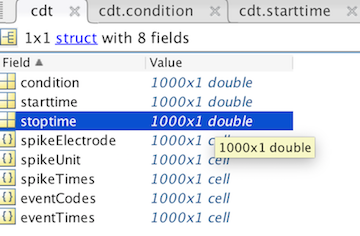
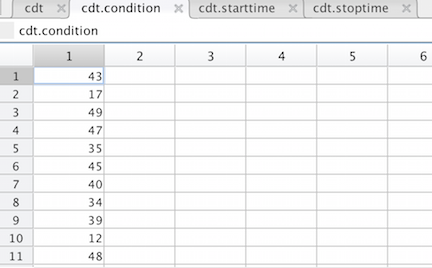
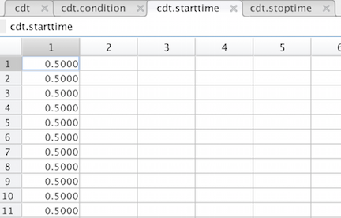
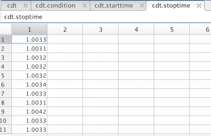
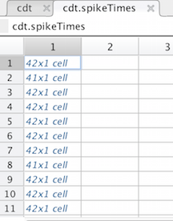
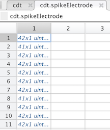
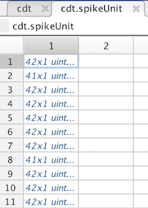
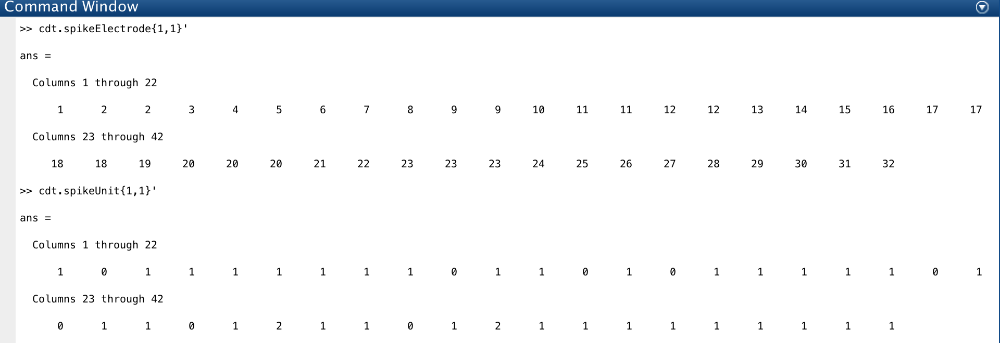
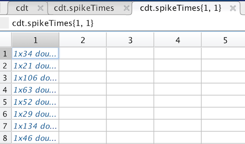
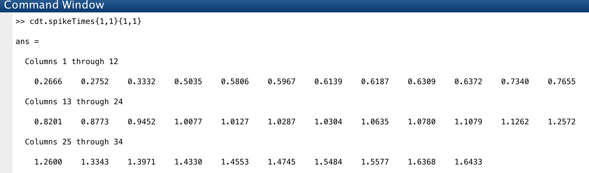

User Guide for CDT table format
===============================

Ge (Summer) Huang

## what's contained in the table


  
Data is organized by trails in the table. As shown in the above fig, we have 1000 trials.

### condition

This filed tells us which stimuli it is showing within each trial. For the example here, we showed condition 43 in the first trial. and condition 17 in the second trial, and then condition #49, #47, #35, #45 ...

  

### starttime and stoptime

When we extract information from raw data to get this table, we select a time point as a reference point within each trail. Then all other events happened within that trial will have a unique time label telling the relative time with respect to that reference time point. In the example given here, we chose the time when the stimuli is truned on as the reference time. Usually, we care about the neurons' responses during the period of stimuli presenting, but we may also want to include some margin before and after the stimulus's onset or offset. So here we add a 500 ms margin both before the stimuli on and after the stimuli off. So all our trials have the start time at 0.5 and stop time at 1.003 in seconds beacause our stimulus was shown for 503 ms. And all trails are aligned at the start time.

 
 

### spikeElextrode, spikeUnit, and spikeTimes

We have 1000 trials here, and for each trail, we have recorded from about 40 neurons simutaneously. We have a 32 electrode implant and some electrodes can successfully capture 2 or even 3 nicely separable neurons, so we have about 40 of them here.

For each trial, we need to keep track of each of the 40 neurons. So you can see that the first element in all those three fields contains again a cell of 42 elements. That's saying that we detected 42 neurons were firing at the first trial. And we detected 41 neurons at the second trial, 42 again at the third trial, and so on.
 
  



If we print out the first element for the spikeElectrode and the spikeUnits, below is what we get.  
  
  

We have one neuron from electrode 1 and it is in unit 1. We have 2 neurons from electrode 2 and they are from unit 0 and 1.

Unlike the electrode and unit, if we click the first element of the spikeTime, below is what we get. It's not a vector containing 42 numbers. It is a cell array containing 42 vectors. This is because for each neuron, it may fire tens or handreds of spikes within a single trial. So instead of just writing down a single number showing which electrode or which unit, we need a vector of numbers showing which time and which other times the neuron spiked. 

   

If we print out the first vector, which represents the first neuron's spiking times, we get below's figure

 

This is telling that the neuron from electrode 1 at unit 1 spiked at time 0.266, 0.2752, 0.3332, 0.5035 in seconds, etc.

### eventCodes and eventTimes

These two are actually not used in our analysis. This is just telling us what events happend and the happening time within each trial. We used the event codes to define a successful trial to extract good trails from the raw data. Say we defined a successful trail to be a trail that had the fixation occurred, stimuli on, stimuli off, eye saccarded, and followed by rewards. Then when we extract the good trails, we use the codes reperesenting these events as a filter. trials containing those codes are kept and trials do not are deposed.


***

## How to use the table 

### select out spike trians from a specific neuron (ith\_electrode and ith\_unit) for each trial

```matlab  
spikeTimesCollected = cellfun(@(spikeTimes,Electrode,Unit) spikeTimes(Electrode==ith_electrode & Unit==ith_unit),cdt.spikeTimes,cdt.spikeElectrode,cdt.spikeUnit,'UniformOutput',false);  
```
This matlab built in function "cellfun" is just saying that I want the same operation on each cell. Since we represent each trial as a cell, we are just saying that for each trial, if the neuron is from ith_electrode and ith_unit, please pull out the spike trians from that neuron. 

Then you can easily get a single neuron's response to either a specific stimulus or a set of stimuli. 
If you want the response of that neuron to one specific stimuli, say the ith_condition:     

```matlab  
spike_times = spikeTimesCollected(cdt.condition == ith_condition);
spike_times = vertcat(spike_times{:});  
```
The second line is just collapsing the cells to get rid of the extra dimention.

Or if you want the average response, you can just add more conditions like this:

```matlab  
spike_times = spikeTimesCollected(cdt.condition == ith_condition & cdt.condition == jth_condition);
spike_times = vertcat(spike_times{:});  
```
Or

```matlab  
spike_times = spikeTimesCollected(ith_condition <= cdt.condition <= jth_condition);
spike_times = vertcat(spike_times{:});  
```
Now you have the spike trains' time, there are many ways you can get the firing rate or spike counts. The way I used a lot is 

```matlab
    spike_times = cell2mat(spike_times(:)');  % integrate spike train times from all trails into a long row vector
    spike_times = spike_times*1000;  % convert seconds into ms
    
    % bin the spiking times with the bin-width to be 1ms.    
    % start from 0ms to trail_length ms
    psth = histc(spike_times,0:trial_length); 
    
    psth = psth(1:end-1); 
    % deal with the margins, you may need to read the documentation of the histc function
```


